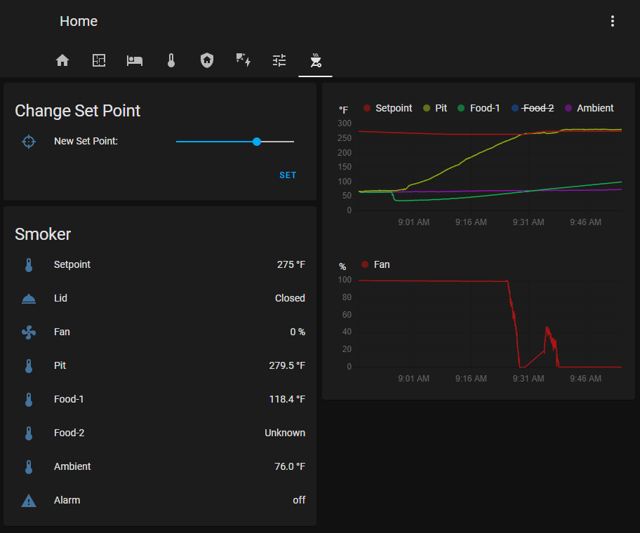

# HeaterMeter smoker controller component for Home Assistant
HeaterMeter smoker controller integration for HA.

Changes from idomp version:
- Changed and normalized C' back to °F', (Must find a way to make this a configuration option).
- Removed username and password configuration options, use api_key instead.
- Added an Alarm sensor that changes to 'on' when any probe's Alarm/Ring value is set to a non-null value.
- Added an Automation example to send push notifications w/ action to mobile app.
- Changed the 'lid' icon to mdi:room-service because it looks more like a BBQ lid.
- Changed the Input_Number's icon to mdi:target.
- Changed the default heatermeter.set_temperature to 225.
- Modified the script.yaml by removing the trigger. (Set Point will be set manually in the Lovelace card).
- Lovelace Card Updates:
  * Now includes a card for setting the Set Point with a slider and 'Set' button.
  * Added history graph for the fan

ToDo:
- Implement scan_interval.
- Make TEMP_FAHRENHEIT / TEMP_CELSIUS a user configurable option or read it from the HeaterMeter config.
- Discovery
- More Controls (individual probe Hi/Lo alarms)

### Getting started

* Copy the 'heatermeter' folder to the Home Assistant config/custom_components/ directory.

#### Home Assistant Example

```
configuration.yaml

heatermeter:
  api_key: <API Key from HeaterMeter>
  host: <Hostname or IP of HeaterMeter>
  port: 80
  scan_interval: time in sec (Not implemented yet)

input_number:
  setpoint:
    name: Setpoint
    initial: 225
    min: 100
    max: 400
    step: 1   
    mode: slider
    unit_of_measurement: "°F"
    icon: mdi:target
```
```
automation.yaml

- id: 'heatermeter_push_notification'
  alias: HeaterMeter Push Notification
  description: ''
  trigger:
  - entity_id: heatermeter.alarm
    platform: state
    to: 'on'
  condition: []
  action:
  - data:
      data:
        actions:
        - action: URI
          title: Go to Card
          uri: /lovelace/heater-meter
      message: HeaterMeter Alarm
    service: notify.mobile_app_<YourPhone>
  mode: single

```
```
scripts.yaml

heatermeter_change_set_point:
  alias: HeaterMeter Change Set Point
  icon: mdi:target
  mode: single
  sequence:
  - data_template:
      temperature: '{{ states.input_number.setpoint.state|int }}'
    service: heatermeter.set_temperature
```
```
ui-lovelace.yaml

  - icon: 'mdi:grill'
    path: heater-meter
    title: Heater Meter
    cards:
      - entities:
          - entity: input_number.setpoint
            name: 'New Set Point:'
          - action_name: Set
            icon: 'mdi:blank'
            name: ' '
            service: script.heatermeter_change_set_point
            type: call-service
        title: Change Set Point
        type: entities
      - entities:
          - entity: heatermeter.setpoint
          - entity: heatermeter.lid
          - entity: heatermeter.fan
          - entity: heatermeter.probe0_temperature
          - entity: heatermeter.probe1_temperature
          - entity: heatermeter.probe2_temperature
          - entity: heatermeter.probe3_temperature
          - entity: heatermeter.alarm
        show_header_toggle: false
        title: Smoker
        type: entities
      - entities:
          - entity: heatermeter.setpoint
          - entity: heatermeter.probe0_temperature
          - entity: heatermeter.probe1_temperature
          - entity: heatermeter.probe2_temperature
          - entity: heatermeter.probe3_temperature
          - entity: heatermeter.fan
        hours_to_show: 18
        refresh_interval: 10
        type: history-graph
```

## :camera: Screenshots

### Lovelace Cards



### HeaterMeter Reference Image


### Mobile App Notification


### Mobile App Cards


### References
Support for reading HeaterMeter data. See https://github.com/CapnBry/HeaterMeter/wiki/Accessing-Raw-Data-Remotely
