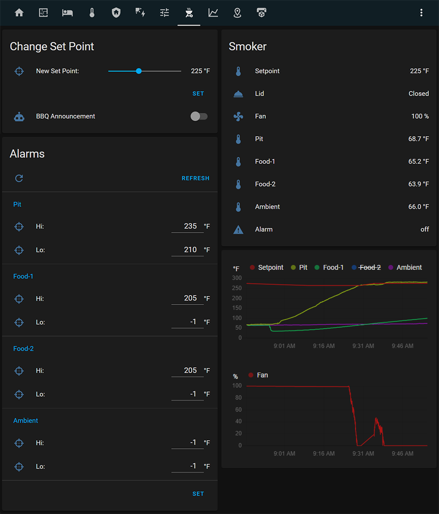
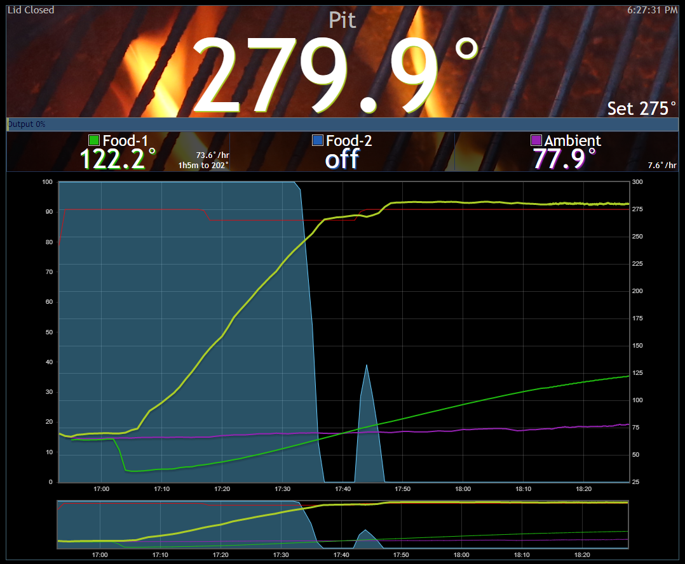
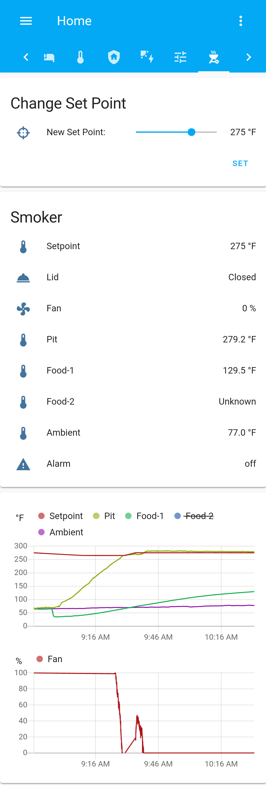

# HeaterMeter smoker controller component for Home Assistant
HeaterMeter smoker controller integration for HA.

Changes from idomp version:
- Added 'heatermeter.set_alarms' and 'heatermeter.set_temperature' scripts for setting & refreshing alarms.
- Added 'Alarms' card to ui-lovalace.yaml.
- Added 'automation.bbq_is_ready' automation to announce when your food is ready.
- Added High/Low Alarm Sensors for each probe.
- Added 'set_alarms' service to set probe alarms.
- Fixed Issue #1 'Fill Example Data inserts parameter twice', removed parameter from service example.
- Temperature units automatically set based on 'Unit System' setting in 'Configuration\General'.
- Removed username and password configuration options, use api_key instead.
- Added an Alarm sensor that changes to 'on' when any probe's Alarm/Ring value is set to a non-null value.
- Added an Automation example to send push notifications w/ action to mobile app.
- Changed the 'lid' icon to mdi:room-service because it looks more like a BBQ lid.
- Changed the Input_Number's icon to mdi:target.
- Changed the default heatermeter.set_temperature to 225.
- Modified the script.yaml by removing the trigger. (Set Point will be set manually in the Lovelace card).
- Lovelace Card Updates:
  * Now includes a card for setting the Set Point with a slider and 'Set' button.
  * Added history graph for the fan.
<br/>

## :heavy_check_mark: ToDo:
- [ ] Implement scan_interval.
- [X] Make TEMP_FAHRENHEIT / TEMP_CELSIUS a user configurable option. ~~or read it from the HeaterMeter config.~~
- [ ] Home Assistant Discovery
- [X] Individual probe Hi/Lo alarms.
- [ ] Create service to enable/disable 'Ramp' mode.
<br/>

## :bookmark_tabs: Table of Contents
- [Screenshots](#camera-screenshots)
- [Getting Started](#getting-started)
- [Example YAML](#home-assistant-examples)
	- [configuration.yaml](#configurationyaml)
	- [automation.yaml](#automationyaml)
	- [scripts.yaml](#scriptsyaml)
	- [ui-lovelace.yaml](#ui-lovelaceyaml)
- [References](#references)
<br/>

## :camera: Screenshots

## Lovelace Cards


### HeaterMeter Reference Image


### Mobile App Notification


### Mobile App Cards
  
[:top:](#bookmark_tabs-table-of-contents)
<br/>
<br/>

## Getting started
* Copy the 'heatermeter' folder to the Home Assistant config/custom_components/ directory.  

[:top:](#bookmark_tabs-table-of-contents)
<br/>
<br/>

## Home Assistant Examples
### configuration.yaml
```
heatermeter:
  api_key: <API Key from HeaterMeter>
  host: <Hostname or IP of HeaterMeter>
  port: 80
  scan_interval: <Time in seconds>  #(Not implemented yet)

input_number:
  setpoint:
    name: Setpoint
    initial: 225
    min:  100
    max:  400
    step: 1   
    mode: slider
    unit_of_measurement: "°F"
    icon: mdi:target
  probe0_hi:
    name: Probe0 Hi
    initial: 275
    min: -400
    max: 400
    step: 1
    mode: box
    unit_of_measurement: "°F"
    icon: mdi:target
  probe0_lo:
    name: Probe0 Lo
    initial: -200
    min: -400
    max: 400
    step: 1   
    mode: box
    unit_of_measurement: "°F"
    icon: mdi:target
  probe1_hi:
    name: Probe1 Hi
    initial: -200
    min: -400
    max: 400
    step: 1   
    mode: box
    unit_of_measurement: "°F"
    icon: mdi:target
  probe1_lo:
    name: Probe1 Lo
    initial: -1
    min: -400
    max: 400
    step: 1   
    mode: box
    unit_of_measurement: "°F"
    icon: mdi:target
  probe2_hi:
    name: Probe2 Hi
    initial: -200
    min: -400
    max: 400
    step: 1   
    mode: box
    unit_of_measurement: "°F"
    icon: mdi:target
  probe2_lo:
    name: Probe2 Lo
    initial: -1
    min: -400
    max: 400
    step: 1   
    mode: box
    unit_of_measurement: "°F"
    icon: mdi:target
  probe3_hi:
    name: Probe3 Hi
    initial: -200
    min: -400
    max: 400
    step: 1   
    mode: box
    unit_of_measurement: "°F"
    icon: mdi:target
  probe3_lo:
    name: Probe3 Lo
    initial: -1
    min: -400
    max: 400
    step: 1   
    mode: box
    unit_of_measurement: "°F"
    icon: mdi:target
```  
[:top:](#bookmark_tabs-table-of-contents)

### automation.yaml
```
- id: 'heatermeter_push_notification'
  alias: HeaterMeter Push Notification
  description: ''
  trigger:
  - entity_id: heatermeter.alarm
    platform: state
    to: 'on'
  condition: []
  action:
  - data:
      data:
        actions:
        - action: URI
          title: Go to Card
          uri: /lovelace/heater-meter
      message: HeaterMeter Alarm
    service: notify.mobile_app_<YourPhone>
  mode: single
- id: 'bbq_is_ready'
  alias: BBQ is Ready
  description: ''
  trigger:
  - platform: template
    value_template: ' true '
  condition:
  - condition: not
    conditions:
    - condition: state
      entity_id: heatermeter.probe1_temperature
      state: Unknown
  action:
  - service: tts.google_translate_say
    entity_id: media_player.living_room_speaker
    data:
      message: Your food is ready to come off the barbeque
  mode: single
```  
Please note that 'tts.google_translate_say' service must be configured for this automation to work and you should change the 'entity_id' to your desired media_player.
[:top:](#bookmark_tabs-table-of-contents)

### scripts.yaml
```
heatermeter_change_set_point:
  alias: HeaterMeter Change Set Point
  icon: mdi:target
  mode: single
  sequence:
  - data_template:
      temperature: '{{ states.input_number.setpoint.state|int }}'
    service: heatermeter.set_temperature
heatermeter_change_set_point:
  alias: HeaterMeter Change Set Point
  icon: mdi:target
  mode: single
  sequence:
  - data_template:
      temperature: '{{ states.input_number.setpoint.state|int }}'
    service: heatermeter.set_temperature
update_heatermeter_input_numbers:
  alias: Update HeaterMeter Input Numbers
  sequence:
  - service: input_number.set_value
    data_template:
      value:
        '
          {{ -1 | int }}
        
          {{ states("heatermeter.probe0_hi") | int }}
        '
    entity_id: input_number.probe0_hi
  - service: input_number.set_value
    data_template:
      value:
        '
          {{ -1 | int }}
        
          {{ states("heatermeter.probe0_lo") | int }}
        '
    entity_id: input_number.probe0_lo
  - service: input_number.set_value
    data_template:
      value:
        '
          {{ -1 | int }}
        
          {{ states("heatermeter.probe1_hi") | int }}
        '
    entity_id: input_number.probe1_hi
  - service: input_number.set_value
    data_template:
      value:
        '
          {{ -1 | int }}
        
          {{ states("heatermeter.probe1_lo") | int }}
        '
    entity_id: input_number.probe1_lo
  - service: input_number.set_value
    data_template:
      value:
        '
          {{ -1 | int }}
        
          {{ states("heatermeter.probe2_hi") | int }}
        '
    entity_id: input_number.probe2_hi
  - service: input_number.set_value
    data_template:
      value:
        '
          {{ -1 | int }}
        
          {{ states("heatermeter.probe2_lo") | int }}
        '
    entity_id: input_number.probe2_lo
  - service: input_number.set_value
    data_template:
      value:
        '
          {{ -1 | int }}
        
          {{ states("heatermeter.probe3_hi") | int }}
        '
    entity_id: input_number.probe3_hi
  - service: input_number.set_value
    data_template:
      value: 
        '
          {{ -1 | int }}
        
          {{ states("heatermeter.probe3_lo") | int }}
        '
    entity_id: input_number.probe3_lo
  mode: single
heatermeter_set_alarms:
  alias: HeaterMeter Set Alarms
  sequence:
  - service: heatermeter.set_alarms
    data_template:
      alarms: '{{ states("input_number.probe0_lo") }},{{ states("input_number.probe0_hi") }},{{ states("input_number.probe1_lo") }},{{ states("input_number.probe1_hi") }}",{{ states("input_number.probe2_lo") }},{{ states("input_number.probe2_hi") }},{{ states("input_number.probe3_lo") }},{{ states("input_number.probe3_hi") }}'
  mode: single
```  
[:top:](#bookmark_tabs-table-of-contents)

### ui-lovelace.yaml
```
  - icon: 'mdi:grill'
    path: heater-meter
    title: Heater Meter
    cards:
      - entities:
          - entity: input_number.setpoint
            name: 'New Set Point:'
          - action_name: Set
            icon: 'mdi:blank'
            name: ' '
            service: script.heatermeter_change_set_point
            type: call-service
        title: Change Set Point
        type: entities
      - entities:
          - entity: heatermeter.setpoint
          - entity: heatermeter.lid
          - entity: heatermeter.fan
          - entity: heatermeter.probe0_temperature
          - entity: heatermeter.probe1_temperature
          - entity: heatermeter.probe2_temperature
          - entity: heatermeter.probe3_temperature
          - entity: heatermeter.alarm
        show_header_toggle: false
        title: Smoker
        type: entities
      - entities:
          - entity: heatermeter.setpoint
          - entity: heatermeter.probe0_temperature
          - entity: heatermeter.probe1_temperature
          - entity: heatermeter.probe2_temperature
          - entity: heatermeter.probe3_temperature
          - entity: heatermeter.fan
        hours_to_show: 18
        refresh_interval: 10
        type: history-graph
      - entities:
          - action_name: Refresh
            icon: 'mdi:refresh'
            name: ' '
            service: script.update_heatermeter_input_numbers
            type: call-service
          - type: section
            label: Pit
          - entity: input_number.probe0_hi
            name: 'Hi:'
          - entity: input_number.probe0_lo
            name: 'Lo:'
          - type: section
            label: Food-1
          - entity: input_number.probe1_hi
            name: 'Hi:'
          - entity: input_number.probe1_lo
            name: 'Lo:'
          - type: section
            label: Food-2
          - entity: input_number.probe2_hi
            name: 'Hi:'
          - entity: input_number.probe2_lo
            name: 'Lo:'
          - type: section
            label: Ambient
          - entity: input_number.probe3_hi
            name: 'Hi:'
          - entity: input_number.probe3_lo
            name: 'Lo:'
          - type: section
          - action_name: Set
            icon: 'mdi:blank'
            name: ' '
            service: script.heatermeter_set_alarms
            type: call-service
        title: Alarms
        type: entities
```  
[:top:](#bookmark_tabs-table-of-contents)
<br/>

## References
Support for reading HeaterMeter data. See https://github.com/CapnBry/HeaterMeter/wiki/Accessing-Raw-Data-Remotely
Home Assistant HeaterMeter integration forum post. https://community.home-assistant.io/t/heatermeter-integration/14696/22  
[:top:](#bookmark_tabs-table-of-contents)
